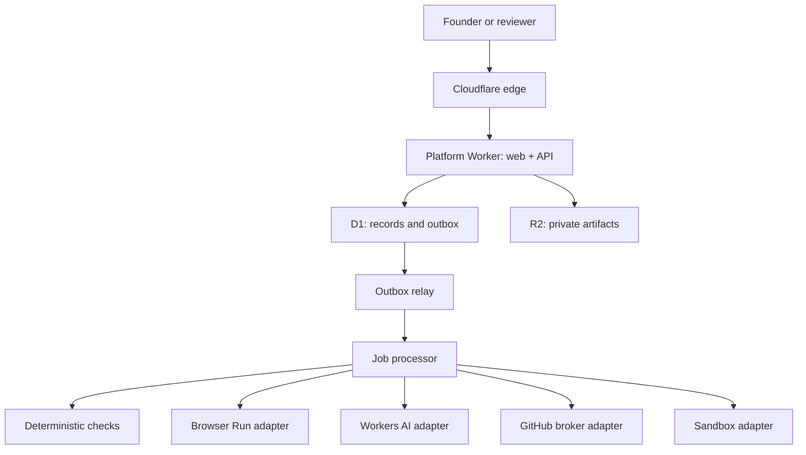

# OCLaunch architecture

## Control plane

See also `docs/oclaunch-architecture.svg` and `docs/control-plane.mmd` from the design pack.

## Binding inventory (MVP)

| Binding | Service | Purpose | Access | Failure behavior |
|---------|---------|---------|--------|------------------|
| `ASSETS` | Static Assets | SPA shell | HTTP | SPA fallback / 503 if unbuilt |
| `DB` | D1 | Projects, ACL, findings, outbox | Prepared SQL | Structured 5xx |
| `ARTIFACTS` | R2 | Evidence, exports, reports | Stream I/O | Structured errors |
| vars | Worker vars | Origins, feature flags | Read-only | Safe defaults (`*_false`) |

### Deferred (adapters present, not provisioned)

| Binding | Purpose | Honest state when missing |
|---------|---------|---------------------------|
| `JOBS` queue | Async ingress | Sync outbox processor in-process |
| `BROWSER` | Human-tester viewport snapshots + route discovery via Browser Run Quick Actions | `integration_not_configured` (never claims screenshots) |
| `AI` | Model suggestions | Empty suggestions (no fakes) |
| `GITHUB` service | Draft PR broker | Webhook/PR disabled |
| `BUILDER` / Sandbox | Isolated builds | Patch job not-configured |
| `ADMISSION` DO | Budget leases | Quotas enforced in D1 for MVP |
| Gateway Worker | `*.orangecloud.vn` | Domain API returns not-configured unless flag + approval |

## Trust boundaries

- Platform origin (`launch.orangecloud.vn`) never executes untrusted preview code.
- Preview/PR path (when enabled) uses isolated hosts and no platform session cookies.
- GitHub private keys stay in a future broker Worker — not in the SPA or sandbox.
- Uploaded SVG/HTML is rejected on the platform origin.

## Data model

Authoritative schema: `migrations/0001_core.sql` (extended from the design-pack reference). Key entities: users/credentials/sessions, projects/members, releases, brand_versions, missions/reviews/annotations, artifacts, findings, change_sets, verifications, reports/shares, domains, jobs/outbox, ledgers, audit, moderation.

## Compatibility date

`compatibility_date = "2026-09-25"` in `workers/platform/wrangler.toml`.
